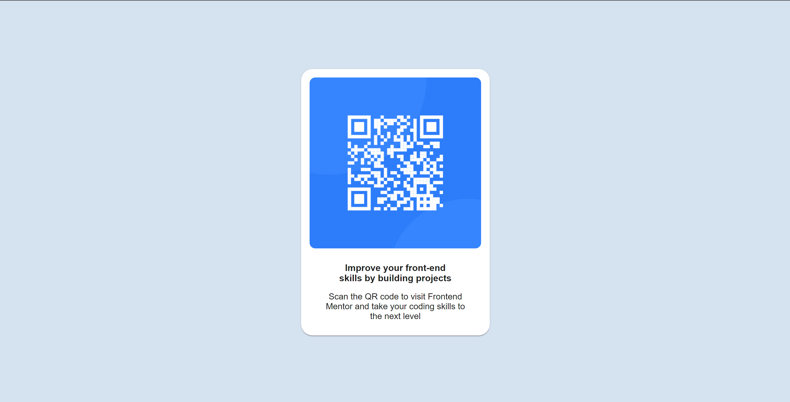

# Frontend Mentor - QR code component solution

This is a solution to the [QR code component challenge on Frontend Mentor](https://www.frontendmentor.io/challenges/qr-code-component-iux_sIO_H). Frontend Mentor challenges help you improve your coding skills by building realistic projects. 

## Table of contents

- [Overview](#overview)
  - [Screenshot](#screenshot)
  - [Links](#links)
- [My process](#my-process)
  - [Built with](#built-with)
  - [What I learned](#what-i-learned)
  - [Continued development](#continued-development)
- [Author](#author)

### Screenshot

### Links

- Solution URL: [Solution GITHUB Repository](https://github.com/apodgornyitba/QR)
- Live Site URL: [Live Site URL](https://apodgornyitba.github.io/QR/)

## My process

### Built with

- [React](https://reactjs.org/) - JS library
- [Next.js](https://nextjs.org/) - React framework
- [Node.js](https://nextjs.org/) - Runtime Engine

### What I learned

- How to use css to format and style different components.
- Get comfortable with GitHup Pages and deployment.
- Creation and use of different components.
- Using already existing React Components.

### Continued development
I want to continue to develop a QR Code generator in which you can introduce any file (PNG, JPG, PDF, etc.) and get a QR code that links to it

## Author

- Website - [Andres Podgorny](https://github.com/apodgornyitba)
- Frontend Mentor - [@apodgornyitba](https://www.frontendmentor.io/profile/apodgornyitba)
- Twitter - [@PodgornyAndres](https://twitter.com/PodgornyAndres)